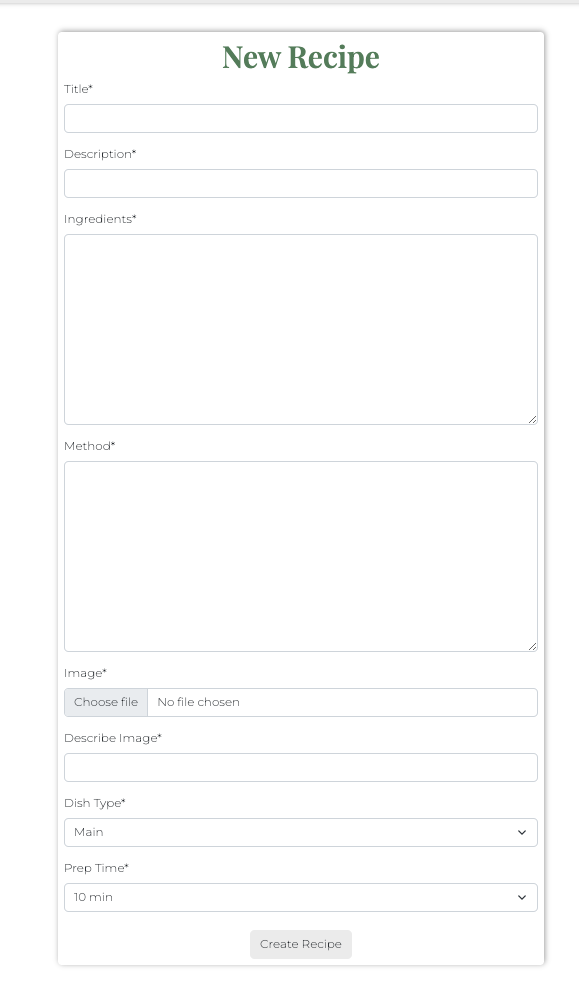
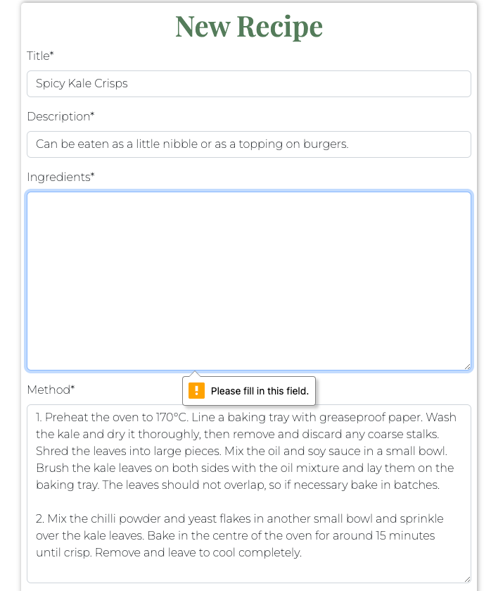
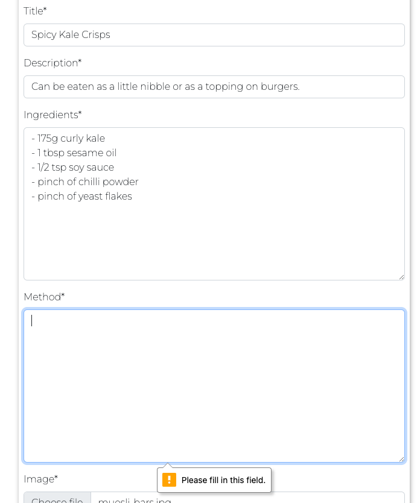
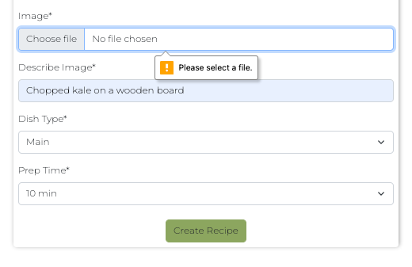
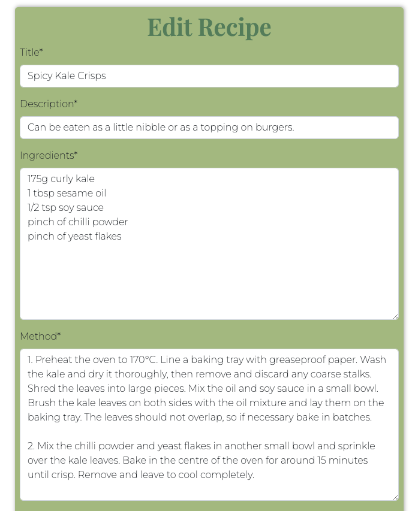
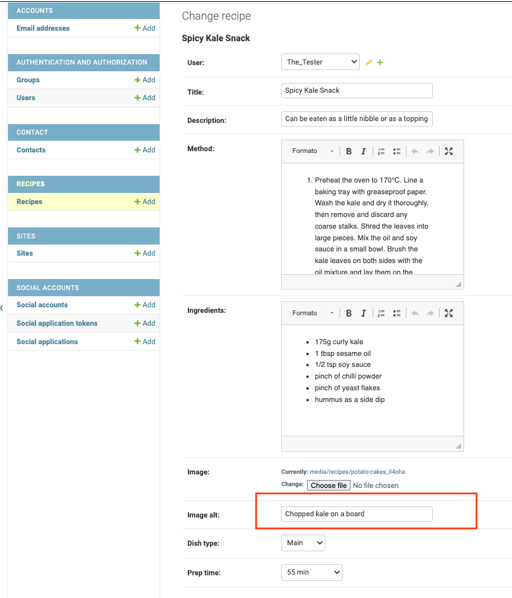

# C'est la V

C'est la V is a website where vegan food lovers can share their favourite recipes and browse existing ones from the database.

Visitors have access to all the recipes stored on the website, can search the database for keywords and can also send a message using the contact form. To be able to add a new recipe, visitors must register as new users. Once registered and signed in, users can add, edit and delete their own recipes.

C'est la V was built using the Django Framework in Python, HTML and CSS. It provides user authentication and full CRUD functionality.

The live website can be accessed here: [C'est la V](https://c-est-la-v-1864b2ffcdf3.herokuapp.com/ "C'est la V Homepage").

## Table of contents
- [C'est la V](#cest-la-v)
  - [Table of contents](#table-of-contents)
  - [UX](#ux)
    - [Site Purpose](#site-purpose)
    - [Site Goal](#site-goal)
    - [Audience:](#audience)
    - [Communication:](#communication)
    - [Current User Goals:](#current-user-goals)
    - [New User Goals:](#new-user-goals)
    - [Future Goals:](#future-goals)
  - [User Stories](#user-stories)
    - [Site user](#site-user)
    - [Admin:](#admin)
  - [Agile Methodology](#agile-methodology)
  - [Design](#design)
    - [Wireframes](#wireframes)
    - [Entity Relationship Diagram](#entity-relationship-diagram)
    - [Colour Scheme](#colour-scheme)
    - [Typography](#typography)
    - [Imagery](#imagery)
  - [Features](#features)
    - [Existing Features](#existing-features)
      - [Home Page](#home-page)
      - [Navigation Bar](#navigation-bar)
        - [Desktop](#desktop)
        - [Mobile](#mobile)
      - [Search Bar](#search-bar)
      - [Countdown](#countdown)
      - [Recipes Page](#recipes-page)
      - [Register Page](#register-page)
      - [Login Page](#login-page)
      - [Logout Page](#logout-page)
      - [Contact Form](#contact-form)
      - [Footer](#footer)
    - [C.R.U.D](#crud)
      - [Create](#create)
      - [Read:](#read)
      - [Update \& Delete](#update--delete)
    - [Features Left to Implement](#features-left-to-implement)
  - [Manual Testing](#manual-testing)
    - [Not logged in:](#not-logged-in)
    - [Homepage](#homepage)
      - [Navbar](#navbar)
      - [Search bar](#search-bar-1)
      - [Countdown](#countdown-1)
      - [Footer Links](#footer-links)
    - [Recipes page](#recipes-page-1)
    - [Register page](#register-page-1)
    - [Login page](#login-page-1)
    - [Contact page](#contact-page)
   

## UX
### Site Purpose
The intent of the site is to promote a vegan diet and inspire anyone who would like to transition towards a plant-based diet to incorporate more vegan food into their diet, by showcasing easy and affordable recipes that are simple to replicate. 

### Site Goal
To build an online platform where vegan food lovers can share their favourite recipes and find inspiration and support from fellow vegans. By displaying the recipes in the database, vegans and aspiring vegans alike will be able to easily browse through the various recipe cards and find something they might want to try.

### Audience:
Anyone who is passionate about fuelling their body with filling and nutricious food. Regardless of the diet label,be it 100% vegan, a part-time vegetarian or a die-hard omnivore, C'est la V has something to appeal everyone.

### Communication:
With a neat and intuitive layout, the user can seamlessly navigate the website and easily access all the features available.

### Current User Goals:
Users can search and discover new recipes. Creators can contribute and add as many recipes as they wish.

### New User Goals:
To have their interest picked and decide to register as new users and start creating and sharing their own recipes.

### Future Goals:
- The user should be able to add comments and likes to existing recipes. 
- The logged in user should have their own account page where they can save their favourite recipes.
- The admin should be able to review any new recipe for approval, before it is published.

## User Stories
Not all stories have been implemented. Some have been left for future implementations.

### Site user

- As a site user I can browse the recipe database so that I can have a look at all the available recipes.
- As a site user I can use the search bar so that I can find recipes containing a specific title or ingredients.
- As a site user I can open a recipe card so that I can read the method and learn how to make the recipe.
- As a site user I can register so that I can add my own recipes.
- As a site user I can add my own recipes so that I can store them and share them on the website.
- As a site user I can edit my own recipes so that I can correct any mistakes or add content if I forgot something.
- As a site user I can delete my own recipes on the site so that they are no longer displayed on the webiste, if I don't want to share them anymore.
- As a site user I can send a message to the site administrator so that I can share feedback or ask questions.
- As a site user I can check the countdown to Veganuary 2024 so that I know how much time is left before the event.

### Admin:
- As a site admin I can view messages submitted via the contact form so that I can communicate with users.
- As a site admin I can add, edit and delete recipes from the admin panel so that new content is displayed, if users do not add any new recipes.
- As a site admin I can delete recipes from the admin panel.

## Agile Methodology

The development of this project was managed and implemented using GitHub Projects Kanban Board. Available here:
<a href="https://github.com/users/Ila-bura/projects/20" target="_blank" rel="noopener" aria-label="Link to GitHub Projects">C'est la V - User Stories</a>

 

## Design
### Wireframes

Before developing the website, a series of low-fi wireframes were designed using Balsamiq Wireframes.

Home Page

Recipe Card

Recipes Page

Sign In

Sign Up

### Entity Relationship Diagram 

### Colour Scheme
The colour palette was generated with Canva, to match the colours of the logo.

### Typography
Two fonts were obtained from the Google Fonts library:

1. Playfair display: Site headings
2. Montserrat: Site body

### Imagery
- The logo was generated from one of the free templates available in Canva.

Logo

- The favicons were generated on Favicon.io.
- The social media icons were sourced from UXWing.
- The recipe images were all sourced from Pexel. Their authors have been mentioned in the Credits section.

## Features

### Existing Features

#### Home Page

#### Navigation Bar

##### Desktop

##### Mobile

#### Search Bar
To search functionality was implemented with the following available search fields: title, description, method and dish type.

#### Countdown

#### Recipes Page

#### Register Page

#### Login Page

#### Logout Page

- The "Logout" link is only visible in the nav bar to users who are signed in. 

#### Contact Form

#### Footer

### C.R.U.D

#### Create 

- The "New" link is only visible in the nav bar to users who are signed in. 
- Clicking this link will bring the user to a form where they can create a new recipe.

#### Read:

#### Update & Delete

- The update & delete features are only accessible to the users who created their recipes.

### Features Left to Implement

- Comment and Like functionality
- Creator profiles
- Password reset
- Social media sign-in

## Manual Testing

### Not logged in:

### Homepage
Every link on the homepage was tested to ensure that it redirects to the appropriate url.

#### Navbar
When user is not logged in, the nav bar looks like this:

- Navbar

- Logo: the homepage reloads.

- Home: the homepage reloads.

- Recipes: the recipe list page opens.

- Register: the sign up page opens.

- Login: the log in page opens.

- Contact: the contact page opens.

#### Search bar

Multiple tests were carried out to test the serach functionality:

-The Go button is clicked without typing anything in the search field: the alert "Please type something" appears in the space right below the nav bar and automatically disappears after 3 seconds. The user is redirected to the Recipes page displaying the full list of recipes.

-A keyword that is known to be in one of the recipe title (e.g "noodles" or "soup") is typed in the search bar and the Go button is clicked. The recipe card containing that keyword in the title is displayed on the page.

-A keyword that is known to be in one of the recipe title (e.g "noodles" or "soup") is typed in the search bar and the enter button is clicked. The recipe card containing that keyword in the title is displayed on the page.

-A keyword that is known to be in the body of multiple recipes (e.g "soy") is typed in the search bar. All the recipe cards containing that keyword are displayed on the page.

-A keyword that is known to be in the description field of one of the recipes (e.g "tartare") is typed in the search bar. The recipe card containing that keyword in the description field is displayed on the page.

-A keyword that corresponds to one of the meal types in the recipe fields (e.g "dessert") is typed in the search bar. All the recipe cards belonging to the relevant meal type are displayed on the page.

-A keyword in all caps (e.g "SUGAR") is typed in the search bar. All the recipe cards containing the keyword "sugar" are displayed on the page.

-A keyword spelled with a combination of lower and upper case letters (e.g "sUGaR" or "Sugar") is typed in the search bar. All the recipe cards containing that keyword are displayed on the page.

-A keyword that is known not to be in any recipe (e.g "meat" or "butter") is typed in the search bar. The alert "Sorry, no recipes found for your search!" appears in the space right below the nav bar and automatically disappears after 3 seconds. The Recipes page reloads showing the title "Latest Vegan Recipes" and no recipes are displayed on the page.

-A combination of random keys and numbers are typed in the search bar. The alert "Sorry, no recipes found for your search!" appears in the space right below the nav bar and automatically disappears after 3 seconds. The Recipes page reloads showing the title "Latest Vegan Recipes" and no recipes displayed on the page.

#### Countdown
The countdown timer is set for the 1st January 2024 at 00:00:00 and it updates every second.

- Countdown

- In the cestlav.js file, temporarily change the countdown date to year 2023 to test the scenario when the countdown will end.
The Hours, Minutes, Days and Seconds are reset to zero and the title "Veganuary 2024 is coming soon" is replaced by "Veganuary 2024 is here!"

#### Footer Links

- Footer

- LinkedIn: a new tab opens with my personal LinkedIn page.

- Instagram: a new tab opens with Instagram landing page.

- GitHub: a new tab opens with my personal GitHub profile.

### Recipes page
The Recipes page displays the same navbar and footer that are found on the homepage.

- Recipes: the Recipes page opens with the latest recipes being displayed in rows of three.

- Recipe card: clicking on one of the recipes listed on the page opens the relevant recipe card. The buttons to edit and delete the recipe are not displayed.

### Register page

- Register page opens with a form to let the user sign up. The hyperlink "Log in" is clickable, in case the user already has an account.

- Click on "Log in": the Sign In page opens with a form to let the user log in.

The form on the Register page has five fields which all need to be filled for the form to be submitted.

- The Email field is not filled: an alert message prompts the user to fill it in.

- The Username field is not filled: an alert message prompts the user to fill it in.

- The Password field is not filled: an alert message prompts the user to fill it in.

- The second Password field is not filled: an alert message prompts the user to fill it in.

- The second Password is not the same as the first one: an alert message prompts the user to type the same password.

- All the fields are duly filled in and the form is submitted. The user is redirected to the homepage and a success message reading "Successfully signed in as 'Username'" appears. The message disappears after 3 seconds. The nav bar now displays two new links: Logout and New. On the other hand, the links "Register" and "Login" are no longer displayed. 

### Login page

- Login page opens with a form to let the user log in. The hyperlink "Sign Up" is clickable, in case the user does not have an account yet.

- Click on "Sign up": the Sign Up page opens with a form to let the user register.

### Contact page

- The Contact page opens with a form to send a message to the site admin. The form has four fields which all need to be filled for the form to be submitted.

- The First Name field is not filled: an alert message prompts the user to fill it in.

- The Last Name field is not filled: an alert message prompts the user to fill it in.

- The Email field is not filled: an alert message prompts the user to fill it in.

- The Message field is not filled: an alert message prompts the user to fill it in.

- All the fields are duly filled in and the form is submitted. The message form is cleared and a success message reading "Thank you for your message!" is displayed. The message disappears after 3 seconds.

- By logging into the Django admin section, the new message can be found in the Contacts section.

### Logged in:

### Homepage
Every link on the homepage was tested to ensure that it redirects to the appropriate url.

#### Navbar
When user is logged in, the nav bar displays two new links: Logout and New. On the other hand, the links "Register" and "Login" are no longer displayed.

- Navbar

- Logo: the homepage reloads.

- Home: the homepage reloads.

- Recipes: the recipe list page opens.

- Logout: the accounts logout page opens.

- New: the Add Recipe page opens.

- Contact: the contact page opens.

#### Search bar

Multiple tests were carried out to test the serach functionality:

-The Go button is clicked without typing anything in the search field: the alert "Please type something" appears in the space right below the nav bar and automatically disappears after 3 seconds. The user is redirected to the Recipes page displaying the full list of recipes.

-A keyword that is known to be in one of the recipe title (e.g "noodles" or "soup") is typed in the search bar and the Go button is clicked. The recipe card containing that keyword in the title is displayed on the page.

-A keyword that is known to be in one of the recipe title (e.g "noodles" or "soup") is typed in the search bar and the enter button is clicked. The recipe card containing that keyword in the title is displayed on the page.

-A keyword that is known to be in the body of multiple recipes (e.g "soy") is typed in the search bar. All the recipe cards containing that keyword are displayed on the page.

-A keyword that is known to be in the description field of one of the recipes (e.g "tartare") is typed in the search bar. The recipe card containing that keyword in the description field is displayed on the page.

-A keyword that corresponds to one of the meal types in the recipe fields (e.g "dessert") is typed in the search bar. All the recipe cards belonging to the relevant meal type are displayed on the page.

-A keyword in all caps (e.g "SUGAR") is typed in the search bar. All the recipe cards containing the keyword "sugar" are displayed on the page.

-A keyword spelled with a combination of lower and upper case letters (e.g "sUGaR" or "Sugar") is typed in the search bar. All the recipe cards containing that keyword are displayed on the page.

-A keyword that is known not to be in any recipe (e.g "meat" or "butter") is typed in the search bar. The alert "Sorry, no recipes found for your search!" appears in the space right below the nav bar and automatically disappears after 3 seconds. The Recipes page reloads showing the title "Latest Vegan Recipes" and no recipes are displayed on the page.

-A combination of random keys and numbers are typed in the search bar. The alert "Sorry, no recipes found for your search!" appears in the space right below the nav bar and automatically disappears after 3 seconds. The Recipes page reloads showing the title "Latest Vegan Recipes" and no recipes displayed on the page.

#### Countdown
The countdown timer is set for the 1st January 2024 at 00:00:00 and it updates every second.

- Countdown

- In the cestlav.js file, temporarily change the countdown date to year 2023 to test the scenario when the countdown will end.
The Hours, Minutes, Days and Seconds are reset to zero and the title "Veganuary 2024 is coming soon" is replaced by "Veganuary 2024 is here!"

#### Footer Links

- Footer

- LinkedIn: a new tab opens with my personal LinkedIn page.

- Instagram: a new tab opens with Instagram landing page.

- GitHub: a new tab opens with my personal GitHub profile.

### Recipes page
The Recipes page displays the same navbar and footer that are found on the homepage.

- Recipes: the Recipes page opens with the latest recipes being displayed in rows of three.

- Recipe card: clicking on one of the recipes listed on the page opens the relevant recipe card. The buttons to edit and delete the recipe are not displayed.

### New

- Add Recipe page opens with a form to let the user create a new recipe. The form has eight fields which all need to be filled for the recipe to be successfully created. The Dish Type and Prep Time fields are prepopulated.

- The Title field is not filled: an alert message prompts the user to fill it in.

- The Description field is not filled: an alert message prompts the user to fill it in.

- The Ingredients field is not filled: the recipe is not created and the page reloads waiting for the user to complete the missing section.

- The Method field is not filled: the recipe is not created and the page reloads waiting for the user to complete the missing section.

- No image is uploaded: an alert message prompts the user to fill it in.

- The Describe Image field is not filled: an alert message prompts the user to fill it in.

- All the fields are duly filled in and the recipe is created. The user is redirected to the Recipes page, where the newly created recipe is showing as first in the list. A success message reading "Recipe added successfully" is displayed. The message disappears after 3 seconds.

- Recipe card: clicking on the newly created recipe opens the relevant recipe card. The name of the recipe creator is displayed as well as the date and time. The buttons to edit and delete the recipe are displayed.

### Edit Recipe

- Edit Recipe: clicking on the Edit button opens the edit form where the user can make amendments to any of the fields of their recipe.

- Edit Title: the title gets changed from "Spicy Kale Crisps" to "Spicy Kale Snack" and the "Save Changes" button is clicked. The user is redirected to the Recipes page and we can see that the latest recipe now shows the updated title. A success message reading "Recipe updated successfully!" is displayed. The message disappears after 3 seconds.

- Edit Description: the description gets shortened by removing the string "or sandwiches" and the "Save Changes" button is clicked. The user is redirected to the Recipes page and we can see that the latest recipe now shows the updated description. A success message reading "Recipe updated successfully!" is displayed. The message disappears after 3 seconds.

- Edit Ingredients: a bullet point is added in the ingredients list and the "Save Changes" button is clicked. The user is redirected to the Recipes page. A success message reading "Recipe updated successfully!" is displayed. The message disappears after 3 seconds. By clicking on the recipe card, we can see that the igredient list now displays an additional bullet point.

- Edit Method: a bullet point is added in the method field and the "Save Changes" button is clicked. The user is redirected to the Recipes page and we can see that the latest recipe now shows the updated image. A success message reading "Recipe updated successfully!" is displayed. The message disappears after 3 seconds.

- Edit the image: a new image is uploaded in a separate field and the "Save Changes" button is clicked. The user is redirected to the Recipes page. A success message reading "Recipe updated successfully!" is displayed. The message disappears after 3 seconds. By clicking on the recipe card, we can see that the method field now displays an additional bullet point.

- Edit the dish type and prep time: the default choices are changed to "Main" and "55 min" respectively and the "Save Changes" button is clicked. The user is redirected to the Recipes page. A success message reading "Recipe updated successfully!" is displayed. The message disappears after 3 seconds. By clicking on the recipe card, we can see that dish type and prep time have been updated.

- Edit the image description: the word "wooden" is removed from the image description and the "Save Changes" button is clicked. The user is redirected to the Recipes page. A success message reading "Recipe updated successfully!" is displayed. The message disappears after 3 seconds. As the image description is not a visibile field in the recipe card, to verify that it was successfully changed, we need to log into the Django admin panel. There, in the Recipes section, we can open the relevant recipe and verify that the image alt description had indeed being changed.

- The The_Tester user opens a recipe that was created by another user, for example, the Cinnamon Swirls. The Edit and Delete buttons are not available for the current logged in user.

### Delete Recipe

- The "Delete" button is clicked in the recipe card. The delete confirmation page loads and a message asks the user to confirm they want to delete the recipe. 

- The "Confirm" button is clicked. The user is redirected to the Recipes page where the deleted recipe is no longer displayed in the list. A success message reading "Recipe deleted successfully!" is displayed. The message disappears after 3 seconds. 

### Logout page

- The Logout page opens with a confirmation question: "Are you sure you want to sign out?" The button "Sign Out" is clickable.

- Click on the "Sign Out" button: the user is signed out, then is redirected to the homepage and a success message reading "You have signed out" appears. The message disappears after 3 seconds. The nav bar now displays the links: Register and Login. On the other hand, the link "New" and "Logout" are no longer displayed

### Contact page

- The Contact page opens with a form to send a message to the site admin. The form has four fields which all need to be filled for the form to be submitted.

- The First Name field is not filled: an alert message prompts the user to fill it in.

- The Last Name field is not filled: an alert message prompts the user to fill it in.

- The Email field is not filled: an alert message prompts the user to fill it in.

- The Message field is not filled: an alert message prompts the user to fill it in.

- All the fields are duly filled in and the form is submitted. The message form is cleared and a success message reading "Thank you for your message!" is displayed. The message disappears after 3 seconds.

- By logging into the Django admin section, the new message can be found in the Contacts section.

