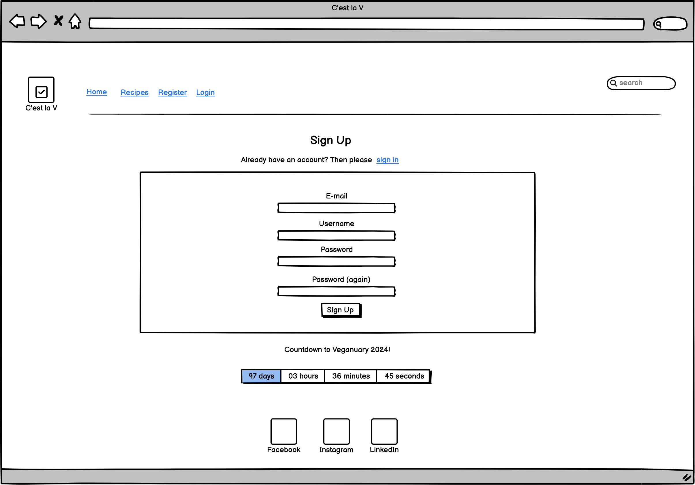
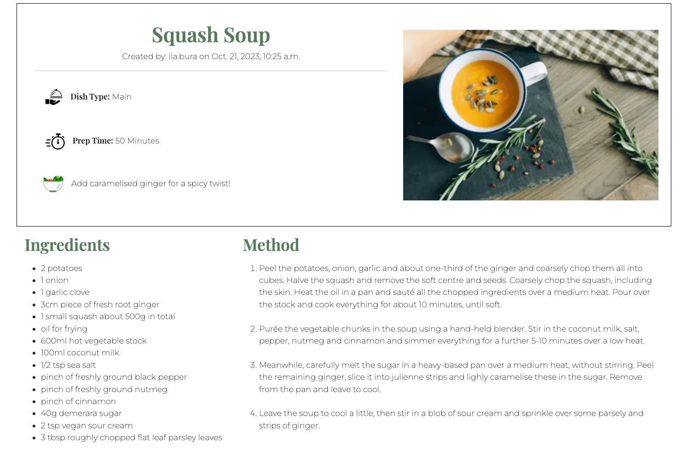

# C'est la V

C'est la V is a website where vegan food lovers can share their favourite recipes and browse existing ones from the database.

Visitors have access to all the recipes stored on the website, can search the database for keywords and can also send a message using the contact form. To be able to add a new recipe, visitors must register as new users. Once registered and signed in, users can add, edit and delete their own recipes.

C'est la V was built using the Django Framework in Python, HTML and CSS. It provides user authentication and full CRUD functionality.

The live website can be accessed here: [C'est la V](https://c-est-la-v-1864b2ffcdf3.herokuapp.com/ "C'est la V Homepage").

## Table of contents
- [C'est la V](#cest-la-v)
  - [Table of contents](#table-of-contents)
  - [UX](#ux)
    - [Site Purpose](#site-purpose)
    - [Site Goal](#site-goal)
    - [Audience:](#audience)
    - [Communication:](#communication)
    - [Current User Goals:](#current-user-goals)
    - [New User Goals:](#new-user-goals)
    - [Future Goals:](#future-goals)
  - [User Stories](#user-stories)
    - [Site user](#site-user)
    - [Admin:](#admin)
  - [Agile Methodology](#agile-methodology)
  - [Design](#design)
    - [Wireframes](#wireframes)
    - [Entity Relationship Diagram](#entity-relationship-diagram)
    - [Colour Scheme](#colour-scheme)
    - [Typography](#typography)
    - [Imagery](#imagery)
  - [Features](#features)
    - [Existing Features](#existing-features)
      - [Home Page](#home-page)
      - [Navigation Bar](#navigation-bar)
        - [Desktop](#desktop)
        - [Mobile](#mobile)
      - [Search Bar](#search-bar)
      - [Countdown](#countdown)
      - [Recipes Page](#recipes-page)
      - [Register Page](#register-page)
      - [Login Page](#login-page)
      - [Logout Page](#logout-page)
      - [Contact Form](#contact-form)
      - [Footer](#footer)
    - [C.R.U.D](#crud)
      - [Create](#create)
      - [Read:](#read)
      - [Update \& Delete](#update--delete)
    - [Features Left to Implement](#features-left-to-implement)
  - [Testing](#testing)
   

## UX
### Site Purpose
The intent of the site is to promote a vegan diet and inspire anyone who would like to transition towards a plant-based diet to incorporate more vegan food into their diet, by showcasing easy and affordable recipes that are simple to replicate. 

### Site Goal
To build an online platform where vegan food lovers can share their favourite recipes and find inspiration and support from fellow vegans. By displaying the recipes in the database, vegans and aspiring vegans alike will be able to easily browse through the various recipe cards and find something they might want to try.

### Audience:
Anyone who is passionate about fuelling their body with filling and nutricious food. Regardless of the diet label,be it 100% vegan, a part-time vegetarian or a die-hard omnivore, C'est la V has something to appeal everyone.

### Communication:
With a neat and intuitive layout, the user can seamlessly navigate the website and easily access all the features available.

### Current User Goals:
Users can search and discover new recipes. Creators can contribute and add as many recipes as they wish.

### New User Goals:
To have their interest picked and decide to register as new users and start creating and sharing their own recipes.

### Future Goals:
- The user should be able to add comments and likes to existing recipes. 
- The logged in user should have their own account page where they can save their favourite recipes.
- The admin should be able to review any new recipe for approval, before it is published.

## User Stories
Not all stories have been implemented. Some have been left for future implementations.

### Site user

- As a site user I can browse the recipe database so that I can have a look at all the available recipes.
- As a site user I can use the search bar so that I can find recipes containing a specific title or ingredients.
- As a site user I can open a recipe card so that I can read the method and learn how to make the recipe.
- As a site user I can register so that I can add my own recipes.
- As a site user I can add my own recipes so that I can store them and share them on the website.
- As a site user I can edit my own recipes so that I can correct any mistakes or add content if I forgot something.
- As a site user I can delete my own recipes on the site so that they are no longer displayed on the webiste, if I don't want to share them anymore.
- As a site user I can send a message to the site administrator so that I can share feedback or ask questions.
- As a site user I can check the countdown to Veganuary 2024 so that I know how much time is left before the event.

### Admin:
- As a site owner I can view messages submitted via the contact form so that I can communicate with users.
- As a site owner I can add, edit and delete recipes from the admin panel so that new content is displayed, if users do not add any new recipes.

## Agile Methodology

The development of this project was managed and implemented using GitHub Projects Kanban Board. Available here:
<a href="https://github.com/users/Ila-bura/projects/20" target="_blank" rel="noopener" aria-label="Link to GitHub Projects">C'est la V - User Stories</a>

 

## Design
### Wireframes

Before developing the website, a series of low-fi wireframes were designed using Balsamiq Wireframes.

Home Page

Recipe Card

Recipes Page

Sign In

Sign Up

### Entity Relationship Diagram 

### Colour Scheme
The colour palette was generated with Canva, to match the colours of the logo.

### Typography
Two fonts were obtained from the Google Fonts library:

1. Playfair display: Site heading/logo, Blog & print titles
2. Montserrat: site navigation & site buttons

### Imagery
- The logo was generated from one of the free templates available in Canva.

Logo

- The favicons were generated on Favicon.io.
- The social media icons were sourced from UXWing.
- The recipe images were all sourced from Pexel. Their authors have been mentioned in the Credits section.

## Features

### Existing Features

#### Home Page

#### Navigation Bar

##### Desktop

##### Mobile

#### Search Bar

#### Countdown

#### Recipes Page

#### Register Page

#### Login Page

#### Logout Page

- The "Logout" link is only visible in the nav bar to users who are signed in. 

#### Contact Form

#### Footer

### C.R.U.D

#### Create 

- The "New" link is only visible in the nav bar to users who are signed in. 
- Clicking this link will bring the user to a form where they can create a new recipe.

#### Read:

#### Update & Delete

- The update & delete feature is only accessible to the users who created their recipes.

### Features Left to Implement

- Comment and Like functionality
- Creator profiles
- Password reset
- Social media sign-in

## Testing