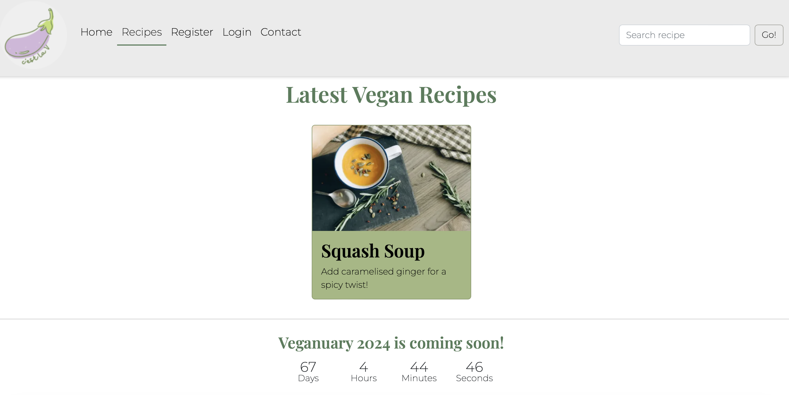
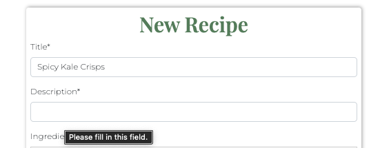
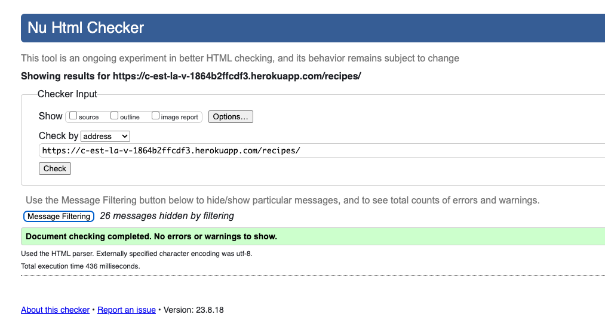
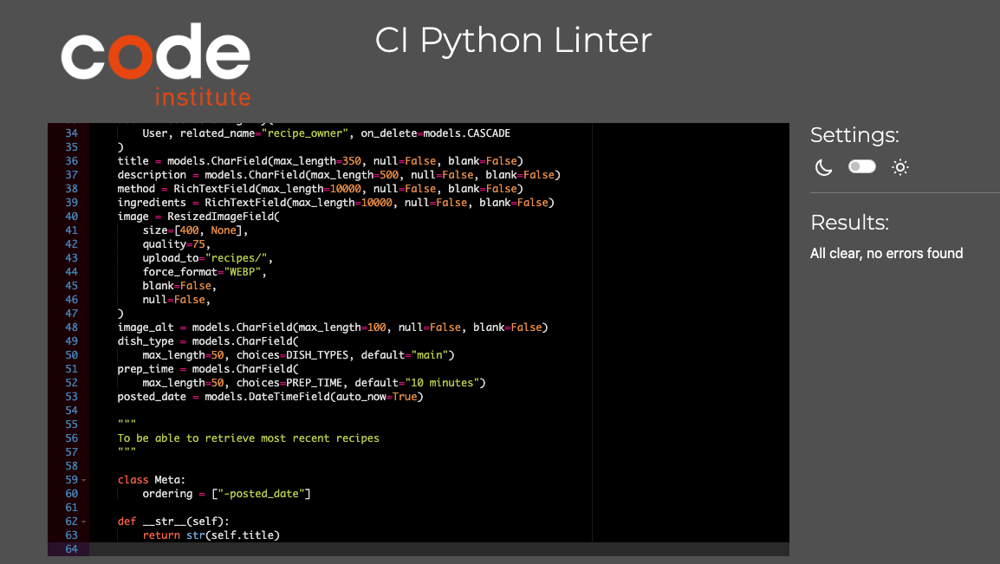
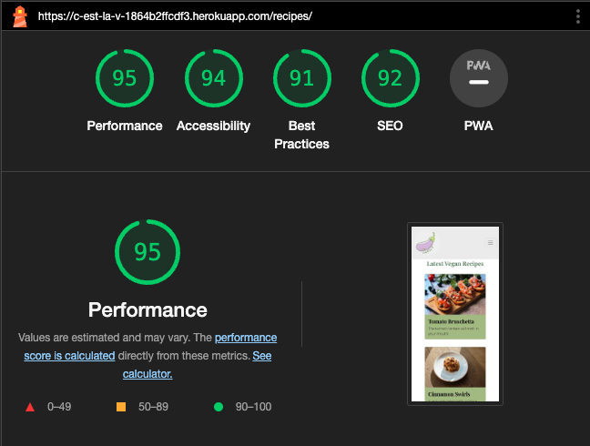
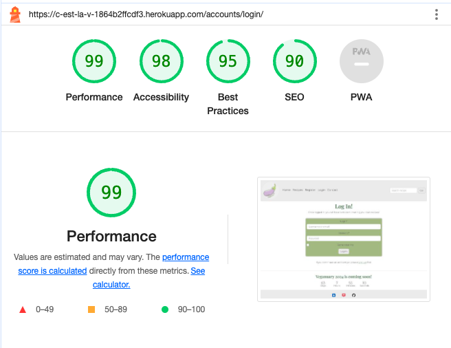

# C'est la V

C'est la V is a website where vegan food lovers can share their favourite recipes and browse existing ones from the database.

Visitors have access to all the recipes stored on the website, can search the database for keywords and can also send a message using the contact form. To be able to add a new recipe, visitors must register as new users. Once registered and signed in, users can add, edit and delete their own recipes.

C'est la V was built using the Django Framework in Python, HTML and CSS. It provides user authentication and full CRUD functionality.

The live website can be accessed here: [C'est la V](https://c-est-la-v-1864b2ffcdf3.herokuapp.com/ "C'est la V Homepage").

## Table of contents

- [C'est la V](#cest-la-v)
  - [Table of contents](#table-of-contents)
  - [UX](#ux)
    - [Site Purpose](#site-purpose)
    - [Site Goal](#site-goal)
    - [Audience](#audience)
    - [Communication](#communication)
    - [Current User Goals](#current-user-goals)
    - [New User Goals](#new-user-goals)
    - [Future Goals](#future-goals)
  - [User Stories](#user-stories)
    - [Site user](#site-user)
    - [Admin](#admin)
  - [Agile Methodology](#agile-methodology)
  - [Design](#design)
    - [Wireframes](#wireframes)
    - [Entity Relationship Diagram](#entity-relationship-diagram)
    - [Colour Scheme](#colour-scheme)
    - [Typography](#typography)
    - [Imagery](#imagery)
  - [Features](#features)
    - [Existing Features](#existing-features)
      - [Home Page](#home-page)
      - [Navigation Bar](#navigation-bar)
        - [Desktop](#desktop)
        - [Mobile](#mobile)
      - [Search Bar](#search-bar)
      - [Countdown](#countdown)
      - [Recipes Page](#recipes-page)
      - [Register Page](#register-page)
      - [Login Page](#login-page)
      - [Logout Page](#logout-page)
      - [Contact Form](#contact-form)
      - [Footer](#footer)
    - [C.R.U.D](#crud)
      - [Create](#create)
      - [Read](#read)
      - [Update \& Delete](#update--delete)
    - [Features Left to Implement](#features-left-to-implement)
  - [Manual Testing](#manual-testing)
    - [Not logged in](#not-logged-in)
    - [Homepage](#homepage)
      - [Navbar](#navbar)
      - [Search bar](#search-bar-1)
      - [Countdown](#countdown-1)
      - [Footer Links](#footer-links)
    - [Recipes page](#recipes-page-1)
    - [Register page](#register-page-1)
    - [Login page](#login-page-1)
    - [Contact page](#contact-page)
    - [Logged in](#logged-in)
    - [Homepage](#homepage-1)
      - [Navbar](#navbar-1)
      - [Search bar](#search-bar-2)
      - [Countdown](#countdown-2)
      - [Footer Links](#footer-links-1)
    - [Recipes page](#recipes-page-2)
    - [New](#new)
    - [Edit Recipe](#edit-recipe)
    - [Delete Recipe](#delete-recipe)
    - [Logout page](#logout-page-1)
    - [Contact page](#contact-page-1)
  - [Admin panel](#admin-panel)
    - [Add Recipes](#add-recipes)
    - [Delete Recipes](#delete-recipes)
    - [Contact](#contact)
    - [Remove users](#remove-users)
  - [Validator Testing](#validator-testing)
    - [HTML files](#html-files)
    - [CSS files](#css-files)
    - [JavaScript file](#javascript-file)
    - [Python files](#python-files)
    - [Browsers](#browsers)
  - [Accessibility](#accessibility)
  - [Fixed bugs](#fixed-bugs)
  - [Unfixed bugs](#unfixed-bugs)
  - [Technologies Used](#technologies-used)
    - [Main Languages Used](#main-languages-used)
    - [Frameworks, Libraries \& Programs Used](#frameworks-libraries--programs-used)
    - [Installed Packages](#installed-packages)
  - [Deployment](#deployment)
  - [Credits](#credits)
    - [Code](#code)
    - [Content](#content)
    - [Images](#images)
  - [Acknowledgments](#acknowledgments)

## UX

### Site Purpose

The intent of the site is to promote vegan food and inspire people who would like to transition towards a plant-based diet, by showcasing simple, tasty and affordable recipes.

### Site Goal

To build an online platform where vegan food lovers can share their favourite recipes and find inspiration and support from fellow vegans. By displaying the recipes in the database, vegans and aspiring vegans alike will be able to easily browse through the various recipe cards and find something they might want to try.

### Audience

Anyone who is passionate about fuelling their body with tasty and nutritious food. Regardless of the diet label, be it 100% vegan, part-time vegetarian or die-hard omnivore, C'est la V has something to appeal everyone.

### Communication

With a neat and intuitive layout, the user can seamlessly navigate the website and easily access all the features available.

### Current User Goals

Users can search and discover new recipes. Creators can contribute and add as many recipes as they wish.

### New User Goals

To have their interest piqued and decide to register as new users and start creating and sharing their own recipes.

### Future Goals

- The user should be able to add comments and likes to existing recipes.
- The logged in user should have their own account page, where they can save their favourite recipes.
- The admin should be able to review any new recipe for approval, before it is published.

## User Stories

Not all stories have been implemented. Some have been left for future implementations.

### Site user

- As a site user I can browse the recipe database so that I can have a look at all the available recipes.
- As a site user I can use the search bar so that I can find recipes containing a specific title or ingredients.
- As a site user I can open a recipe card so that I can read the method and learn how to make the recipe.
- As a site user I can register so that I can add my own recipes.
- As a site user I can add my own recipes so that I can store them and share them on the website.
- As a site user I can edit my own recipes so that I can correct any mistakes or add content if I forgot something.
- As a site user I can delete my own recipes from the site so that they are no longer displayed, if I don't want to share them anymore.
- As a site user I can send a message to the site administrator so that I can share feedback or ask questions.
- As a site user I can check the countdown to Veganuary 2024 so that I know how much time is left before the event.

### Admin

- As a site admin I can view messages submitted via the contact form so that I can communicate with users.
- As a site admin I can add, edit and delete recipes from the admin panel so that new content is displayed, if users do not add any new recipes.
- As a site admin I can delete recipes, if necessary, through the admin panel.
- As a site admin I can delete users, if necessary, through the admin panel.

## Agile Methodology

The development of this project was managed and tracked using GitHub Projects Kanban Board:
<a href="https://github.com/users/Ila-bura/projects/20" target="_blank" rel="noopener" aria-label="Link to GitHub Projects">C'est la V - User Stories</a>

## Design

### Wireframes

Before developing the website, a series of low-fi wireframes were designed using Balsamiq Wireframes.

Home Page

Recipe Card

Recipes Page

Sign In

Sign Up

### Entity Relationship Diagram

Entity Relationship Diagram

### Colour Scheme

The colour palette was generated with Canva, to match the colours of the logo.

Colour Scheme

### Typography

Two fonts were obtained from the Google Fonts library:

1. Playfair display: used for the headings;
2. Montserrat: used for the body;

### Imagery

- The logo was generated from one of the free templates available in Canva.

Logo

- The favicons were generated on Favicon.io.
- The social media icons were sourced from UXWing.
- The recipe images were all sourced from Pexels. Their authors have been mentioned in the Credits section.

## Features

### Existing Features

#### Home Page

Home page

#### Navigation Bar

##### Desktop

Navbar desktop

##### Mobile

Navbar mobile

#### Search Bar

To search functionality was implemented with the following available search fields: title, description, method and dish type.

Search bar

#### Countdown

Countdown

#### Recipes Page

Recipes

#### Register Page

Register Page

#### Login Page

Login Page

#### Logout Page

Logout Page

- The "Logout" link is only visible in the nav bar to users who are signed in.

#### Contact Form

Contact Form

#### Footer

Footer

### C.R.U.D

#### Create

- The "New" link is only visible in the nav bar to users who are signed in.
- Clicking this link will bring the user to a form where they can create a new recipe.

New Recipe Page

#### Read

Recipe Card

#### Update & Delete

The update and delete features are only accessible to the users who created their recipes.

CRUD - Update and Delete

### Features Left to Implement

- Comment and Like functionality
- Creator profiles
- Password reset
- Social media sign-in

## Manual Testing

### Not logged in

### Homepage

Every link on the homepage was tested to ensure that it redirects to the appropriate url.

#### Navbar

When user is not logged in, the nav bar looks like this:

Navbar

Logo: the homepage reloads.

Home: the homepage reloads.

Recipes: the recipe list page opens.

Register: the sign up page opens.

Login: the log in page opens.

Contact: the contact page opens.

#### Search bar

Multiple tests were carried out to test the search functionality:

The Go button is clicked without typing anything in the search field: the alert "Please type something" appears in the space right below the nav bar and automatically disappears after 3 seconds. The user is redirected to the Recipes page displaying the full list of recipes.

A keyword that is known to be in one of the recipe title (e.g "noodles" or "soup") is typed in the search bar and the Go button is clicked. The recipe card containing that keyword in the title is displayed on the page.

A keyword that is known to be in one of the recipe title (e.g "noodles" or "soup") is typed in the search bar and the enter button is clicked. The recipe card containing that keyword in the title is displayed on the page.

A keyword that is known to be in the body of multiple recipes (e.g "soy") is typed in the search bar. All the recipe cards containing that keyword are displayed on the page.

A keyword that is known to be in the description field of one of the recipes (e.g "tartare") is typed in the search bar. The recipe card containing that keyword in the description field is displayed on the page.

A keyword that corresponds to one of the meal types in the recipe fields (e.g "dessert") is typed in the search bar. All the recipe cards belonging to the relevant meal type are displayed on the page.

A keyword in all caps (e.g "SUGAR") is typed in the search bar. All the recipe cards containing the keyword "sugar" are displayed on the page.

A keyword spelled with a combination of lower and upper case letters (e.g "sUGaR" or "Sugar") is typed in the search bar. All the recipe cards containing that keyword are displayed on the page.

A keyword that is known not to be in any recipe (e.g "meat" or "butter") is typed in the search bar. The alert "Sorry, no recipes found for your search!" appears in the space right below the nav bar and automatically disappears after 3 seconds. The Recipes page reloads showing the title "Latest Vegan Recipes" and no recipes are displayed on the page.

A combination of random keys and numbers are typed in the search bar. The alert "Sorry, no recipes found for your search!" appears in the space right below the nav bar and automatically disappears after 3 seconds. The Recipes page reloads showing the title "Latest Vegan Recipes" and no recipes displayed on the page.

#### Countdown

The countdown timer is set for the 1st January 2024 at 00:00:00 and it updates every second.

Countdown

In the cestlav.js file, the countdown date was temporarily changed to year 2023 to test the scenario when the countdown will end.
The Hours, Minutes, Days and Seconds are reset to zero and the title "Veganuary 2024 is coming soon" is replaced by "Veganuary 2024 is here!"

#### Footer Links

Footer

LinkedIn: a new tab opens with my personal LinkedIn page.

Instagram: a new tab opens with Instagram landing page.

GitHub: a new tab opens with my personal GitHub profile.

### Recipes page

The Recipes page displays the same navbar and footer that are found on the homepage.

Recipes: the Recipes page opens with the latest recipes being displayed in rows of three.

Recipe card: clicking on one of the recipes listed on the page opens the relevant recipe card. The buttons to edit and delete the recipe are not displayed.

### Register page

Register page opens with a form to let the user sign up. The hyperlink "Log in" is clickable, in case the user already has an account.

Click on "Log in": the Sign In page opens with a form to let the user log in.

The form on the Register page has five fields which all need to be filled for the form to be submitted.

The Email field is not filled: an alert message prompts the user to fill it in.

The Username field is not filled: an alert message prompts the user to fill it in.

The Password field is not filled: an alert message prompts the user to fill it in.

The second Password field is not filled: an alert message prompts the user to fill it in.

The second Password is not the same as the first one: an alert message prompts the user to type the same password.

All the fields are duly filled in and the form is submitted. The user is redirected to the homepage and a success message reading "Successfully signed in as 'Username'" appears. The message disappears after 3 seconds. The nav bar now displays two new links: Logout and New. On the other hand, the links "Register" and "Login" are no longer displayed. 

### Login page

Login page opens with a form to let the user log in. The hyperlink "Sign Up" is clickable, in case the user does not have an account yet.

Click on "Sign up": the Sign Up page opens with a form to let the user register.

### Contact page

The Contact page opens with a form to send a message to the site admin. The form has four fields which all need to be filled for the form to be submitted.

The First Name field is not filled: an alert message prompts the user to fill it in.

The Last Name field is not filled: an alert message prompts the user to fill it in.

The Email field is not filled: an alert message prompts the user to fill it in.

The Message field is not filled: an alert message prompts the user to fill it in.

All the fields are duly filled in and the form is submitted. The message form is cleared and a success message reading "Thank you for your message!" is displayed. The message disappears after 3 seconds.

By logging into the Django admin section, the new message can be found in the Contacts section.

### Logged in

### Homepage

Every link on the homepage was tested to ensure that it redirects to the appropriate url.

#### Navbar

When user is logged in, the nav bar displays two new links: "Logout" and "New". On the other hand, the links "Register" and "Login" are no longer displayed.

Navbar

Logo: the homepage reloads.

Home: the homepage reloads.

Recipes: the recipe list page opens.

Logout: the accounts logout page opens.

New: the Add Recipe page opens.

Contact: the contact page opens.

#### Search bar

Multiple tests were carried out to test the search functionality:

The Go button is clicked without typing anything in the search field: the alert "Please type something" appears in the space right below the nav bar and automatically disappears after 3 seconds. The user is redirected to the Recipes page displaying the full list of recipes.

A keyword that is known to be in one of the recipe title (e.g "noodles" or "soup") is typed in the search bar and the Go button is clicked. The recipe card containing that keyword in the title is displayed on the page.

A keyword that is known to be in one of the recipe title (e.g "noodles" or "soup") is typed in the search bar and the enter button is clicked. The recipe card containing that keyword in the title is displayed on the page.

A keyword that is known to be in the body of multiple recipes (e.g "soy") is typed in the search bar. All the recipe cards containing that keyword are displayed on the page.

A keyword that is known to be in the description field of one of the recipes (e.g "tartare") is typed in the search bar. The recipe card containing that keyword in the description field is displayed on the page.

A keyword that corresponds to one of the meal types in the recipe fields (e.g "dessert") is typed in the search bar. All the recipe cards belonging to the relevant meal type are displayed on the page.

A keyword in all caps (e.g "SUGAR") is typed in the search bar. All the recipe cards containing the keyword "sugar" are displayed on the page.

A keyword spelled with a combination of lower and upper case letters (e.g "sUGaR" or "Sugar") is typed in the search bar. All the recipe cards containing that keyword are displayed on the page.

A keyword that is known not to be in any recipe (e.g "meat" or "butter") is typed in the search bar. The alert "Sorry, no recipes found for your search!" appears in the space right below the nav bar and automatically disappears after 3 seconds. The Recipes page reloads showing the title "Latest Vegan Recipes" and no recipes are displayed on the page.

A combination of random keys and numbers are typed in the search bar. The alert "Sorry, no recipes found for your search!" appears in the space right below the nav bar and automatically disappears after 3 seconds. The Recipes page reloads showing the title "Latest Vegan Recipes" and no recipes displayed on the page.

#### Countdown

The countdown timer is set for the 1st January 2024 at 00:00:00 and it updates every second.

Countdown

In the cestlav.js file, the countdown date was temporarily changed to year 2023 to test the scenario when the countdown will end.
The Hours, Minutes, Days and Seconds are reset to zero and the title "Veganuary 2024 is coming soon" is replaced by "Veganuary 2024 is here!"

#### Footer Links

Footer

LinkedIn: a new tab opens with my personal LinkedIn page.

Instagram: a new tab opens with Instagram landing page.

GitHub: a new tab opens with my personal GitHub profile.

### Recipes page

The Recipes page displays the same navbar and footer that are found on the homepage.

Recipes: the Recipes page opens with the latest recipes being displayed in rows of three.

Recipe card: clicking on one of the recipes listed on the page opens the relevant recipe card. The buttons to edit and delete the recipe are not displayed.

### New

Add Recipe page opens with a form to let the user create a new recipe. The form has eight fields which all need to be filled for the recipe to be successfully created. The Dish Type and Prep Time fields are prepopulated.

The Title field is not filled: an alert message prompts the user to fill it in.

The Description field is not filled: an alert message prompts the user to fill it in.

The Ingredients field is not filled: the recipe is not created and the page reloads waiting for the user to complete the missing section.

The Method field is not filled: the recipe is not created and the page reloads waiting for the user to complete the missing section.

No image is uploaded: an alert message prompts the user to fill it in.

The Describe Image field is not filled: an alert message prompts the user to fill it in.

All the fields are duly filled in and the "Create Recipe" button is clicked. The user is redirected to the Recipes page, where the newly created recipe is showing as first in the list. A success message reading "Recipe added successfully" is displayed. The message disappears after 3 seconds.

Recipe card: clicking on the newly created recipe opens the relevant recipe card. The name of the recipe creator is displayed as well as the date and time when the recipe was created. The buttons to edit and delete the recipe are displayed.

### Edit Recipe

Edit Recipe: clicking on the Edit button opens the edit form where the user can make amendments to any of the fields of their recipe.

Edit Title: the title gets changed from "Spicy Kale Crisps" to "Spicy Kale Snack" and the "Save Changes" button is clicked. The user is redirected to the Recipes page and we can see that the latest recipe now shows the updated title. A success message reading "Recipe updated successfully!" is displayed. The message disappears after 3 seconds.

Edit Description: the description gets shortened by removing the string "or sandwiches" and the "Save Changes" button is clicked. The user is redirected to the Recipes page and we can see that the latest recipe now shows the updated description. A success message reading "Recipe updated successfully!" is displayed. The message disappears after 3 seconds.

Edit Ingredients: a bullet point is added in the ingredients list and the "Save Changes" button is clicked. The user is redirected to the Recipes page. A success message reading "Recipe updated successfully!" is displayed. The message disappears after 3 seconds. By clicking on the recipe card, we can see that the ingredient list now displays an additional bullet point.

Edit Method: a bullet point is added in the method field and the "Save Changes" button is clicked. The user is redirected to the Recipes page and we can see that the latest recipe now shows the updated image. A success message reading "Recipe updated successfully!" is displayed. The message disappears after 3 seconds.

Edit the image: a new image is uploaded in a separate field and the "Save Changes" button is clicked. The user is redirected to the Recipes page and we can see that the latest recipe now shows the updated image. A success message reading "Recipe updated successfully!" is displayed.

Edit the dish type and prep time: the default choices are changed to "Main" and "55 min" respectively and the "Save Changes" button is clicked. The user is redirected to the Recipes page. A success message reading "Recipe updated successfully!" is displayed. The message disappears after 3 seconds. By clicking on the recipe card, we can see that dish type and prep time have been updated.

Edit the image description: the word "wooden" is removed from the image description and the "Save Changes" button is clicked. The user is redirected to the Recipes page. A success message reading "Recipe updated successfully!" is displayed. The message disappears after 3 seconds. As the image description is not a visibile field in the recipe card, to verify that it was successfully changed, we need to log into the Django admin panel. There, in the Recipes section, we can open the relevant recipe and verify that the image alt description was indeed updated.

The_Tester user opens a recipe that was created by another user, for example, the Cinnamon Swirls. The Edit and Delete buttons are not available for the current logged in user.

### Delete Recipe

The "Delete" button is clicked in the recently created "Spicy Kale Snack" recipe card. The delete confirmation page loads and a message asks the user to confirm they want to delete the recipe. 

The "Confirm" button is clicked. The user is redirected to the Recipes page where the deleted recipe is no longer displayed in the list. A success message reading "Recipe deleted successfully!" is displayed. The message disappears after 3 seconds. 

### Logout page

The Logout page opens with a confirmation question: "Are you sure you want to sign out?". The button "Sign Out" is clickable.

Click on the "Sign Out" button: the user is signed out, then is redirected to the homepage and a success message reading "You have signed out" appears. The message disappears after 3 seconds. The nav bar now displays the links: "Register" and "Login". On the other hand, the link "New" and "Logout" are no longer displayed

### Contact page

The Contact page opens with a form to send a message to the site admin. The form has four fields which all need to be filled for the form to be submitted.

The First Name field is not filled: an alert message prompts the user to fill it in.

The Last Name field is not filled: an alert message prompts the user to fill it in.

The Email field is not filled: an alert message prompts the user to fill it in.

The Message field is not filled: an alert message prompts the user to fill it in.

All the fields are duly filled in and the form is submitted. The message form is cleared and a success message reading "Thank you for your message!" is displayed. The message disappears after 3 seconds.

By logging into the Django admin section, the new message can be found in the Contacts section.

## Admin panel

When we login to Django admin panel we access the admin page.

### Add Recipes

As a site admin I can create recipes to share with other users.

### Delete Recipes

As a site admin I can delete any recipe that is created by any user.

### Contact

As a site admin I can view messages submitted via the contact form so that I can communicate with site users.

Within the admin panel, the admin can select Contacts:

Here, the admin can click into messages to read them:

### Remove users

As a site admin I can remove users so that they will no longer be able to post unsuitable content. When a user is deleted, all of their recipes get deleted as well.

Here, the admin can select users to delete:

## Validator Testing

#### HTML files

The HTML files pass through the [W3C validator](https://validator.w3.org/) with no HTML issues found. Errors listed only reference  & {{}} tags.

Home page

Recipes

The validator fails to recognize the content of the paragraph tags.

Sign Up

Log In

New

Contact

Sign Out

#### CSS files

The CSS file passes through the [Jigsaw validator](https://jigsaw.w3.org/css-validator/) with no issues found.

Jigsaw validator message

#### JavaScript file

The JavaScript file passes through the [JSHint validator](https://jshint.com/) with no issues found.

JSHint validator message

#### Python files

The Python files pass through [PEP8 Code Institute](https://pep8ci.herokuapp.com/) with no issues found.

Blog apps.py

Blog urls.py

Blog views.py

Cestlav asgi.py

Cestlav urls.py

Cestlav wsgi.py

Contact admin.py

Contact apps.py

Contact forms.py

Contact models.py

Contact urls.py

Contact views.py

Recipes admin.py

Recipes apps.py

Recipes forms.py

Recipes models.py

Recipes urls.py

Recipes views.py

### Browsers

- I checked the site for compatibility on different browsers (Chrome, Firefox).
- I have checked the responsiveness on different window sizes.

## Accessibility

The app has an excellent Accessibility rating in Lighthouse:

Homepage

Recipes

Register

Login

Contact

New

Logout

## Fixed bugs

Syntax Error

The first recurring bug I have encountered was a syntax error: the block tags kept getting broken between two different lines. I was able to manually fix it to be on the same line, but after saving my changes, the block tags were auto-formatting and the syntax error was there again. I solved this by turning off the "Format On Save" in the Code Anywhere IDE Settings.

Static Files not rendered

The first time I attempted the deployment of the app with Heroku, the static files (logo, favicons, icons and the CSS styles) failed to be rendered in the deployed version.

Following the suggestions from fellow students in past Slack threads, I firstly tried changing DEBUG = 'DEVELOPMENT' in os.environ, added os.environ["DEVELOPMENT"] = "1" in env.py. This however, did not solve the issue and I still got the 400 Bad Request message.

I then followed Daisy mentor's suggestion and installed whitenoise and added "whitenoise.middleware" to the middleware list to render the favicons directly from the static files.
The 400 Bad Request message was solved by removing a slash at the start of the file paths, which was preventing access the assets folder.

Messages not defined

When implementing the customised success messages with Django, I came across the error: "Name 'messages' is not defined". This was caused by failing to import the 'messages' framework in my views.py file. Once imported, the error was solved.

innerHTML error

When implementing the countdown, I initially decided to avoid creating a separate .js file and added the JavaScript code in a script tag inside the index.html file. The countdown was only showing on the homepage. Despite working smoothly on the front-end, an error message was found in the console.
It took me some time to figure out the reason behind this error and I solved it with multiple trial and errors. Eventually, I created a separate .js file where I stored the code for the countdown and moved the HTML code for the countdown in the footer.html file.

## Unfixed bugs

Alert message

Requirements.

    
    

## Deployment

Creating Database using ElephantSQL

1. To generate a managed PostgreSQL database, please proceed to [ElephantSQL](https://customer.elephantsql.com/) and either sign up or sign in to your account. Once you've logged in, click on the 'Create New Instance' button.

2. Name your database and select the 'Tiny Turtle' payment plan. Then, click on 'Select Region'

3. Select your preferred region and create the database instance.

4. After creating the instance, navigate to the instances page and click on the name of the database you selected earlier. Then, in the details section on the following page, copy the PostgreSQL URL.

Deploying the website in Heroku

Before deploying in Heroku following files were created:

1. env.py : stores confidential data eg. API keys, passwords etc.

2. Procfile : Very important for deployment and must be added with capital P

3. Requirements.txt: This must be updated for deployment in Heroku. It stores data of libraries used for the project.

The website was deployed to Heroku following these steps:

1. Login or create an account with Heroku
2. Creating an app
  - Create new app in the top right of the screen and add an app name.
  - Select region
  - Then click "create app".
3. Open settings Tab
4. Click on config var
   - Store CLOUDINARY_URL file from in key and add the values
   - Store DATABASE_URL file from in key and add the values
   - Store SECRET_KEY file from in key and add the values
   - Store PORT in key and value

NOTE: For the initial deployment DISABLE_COLLECTSTATIC was also added.

Add Buildpacks
- Add Python buildpack

Open Deploy Tab
Choose deployment method and Connect to Github

- Connect GITHUB
- Login if prompted
- Choose repositories you want to connect
- Click "Connect"

Automatic and Manual deploy

- Choose a method to deploy
- After Deploy is clicked it will install various files.

Final Deployment

- A view button will display
- Once clicked the website will open.

The live link for "C'est la V" can be found [HERE](https://c-est-la-v-1864b2ffcdf3.herokuapp.com/)

## Credits

### Code

- To set up the initial structure of the app and to implement the Django error messages, I followed the Code Institute tutorial "I think therefore I blog".
- For the recipes model and to implement the search and authentication functionalities, I followed the YouTube tutorial videos by [Dee Mc](https://www.youtube.com/watch?v=sBjbty691eI&list=PLXuTq6OsqZjbCSfiLNb2f1FOs8viArjWy); 
- To better understand Django, I also watched the Code Institute masterclass: [Django Blog Webinar](https://www.youtube.com/watch?v=YH--VobIA8c) and a few Django walkthrough videos from [Codemycom](https://www.youtube.com/c/Codemycom)
- To implement the countdown, I followed the YouTube tutorial by [GreatStack](https://www.youtube.com/watch?v=_LExTzOhe7s)
- To implement the Agile methodology in GitHub, I followed [The guide to the Github Agile Tool](https://www.youtube.com/watch?v=U_dMihBgUNY) by Kasia Bogucka

### Content
The recipes were adapted from the following recipe books:
-  Vegan on the go by J. Eckmeier and D. Lais
-  Deliciously Ella by E. Woodward

### Images

The images of the recipes were sourced from [pexels.com](https://www.pexels.com/):

- Cinnamon Swirls - [Photo by Polina Tankilevitch](https://www.pexels.com/photo/close-up-of-a-cinnamon-roll-with-walnuts-5419186/)
- Sweet Potato Burgers - [Photo by Markus Spiske](https://www.pexels.com/photo/burger-with-lettuce-and-tomato-on-white-and-red-round-plate-116739/)
- Tomato Bruschetta - [Photo by Shameel mukkath](https://www.pexels.com/photo/bruschetta-with-tomatoes-black-olives-and-basil-5639411/)
- Rice & Bean Burritos - [Photo by Harish .P](https://www.pexels.com/photo/burrito-on-white-ceramic-plate-11136408/)
- Sweetcorn Frittatas - [Photo by Shameel mukkath](https://www.pexels.com/photo/a-close-up-shot-of-a-frittata-in-a-skillet-5639255/)
- Spicy Kale Crisps - [Photo by Eva Bronzini](https://www.pexels.com/photo/close-up-shot-of-kale-on-a-wooden-chopping-board-5755943/)
- Asparagus Quiche - [Photo by Amanda Reed](https://www.pexels.com/photo/three-round-pies-288264/)
- Chia Seed Muffins - [Photo by ROMAN ODINTSOV](https://www.pexels.com/photo/top-view-of-a-raw-muffins-on-a-tray-5847181/)
- Squash Soup - [Photo by Nataliya Vaitkevich](https://www.pexels.com/photo/overhead-shot-of-pumpkin-soup-in-a-mug-5605523/)
- Potato Cakes - [Photo by Julia Avamotive](https://www.pexels.com/photo/person-dipping-celery-on-a-ranch-dip-6369302/)
- Buckwheat Pancakes - [Photo by Monstera Product](https://www.pexels.com/photo/delicious-buckwheat-pancakes-with-apples-on-table-7144690/)
- Granny's Pearl Barley Stew - [Photo by Roy Sloan](https://www.pexels.com/photo/homemade-stew-in-bowl-6166796/)
- Chia & Cashew Pudding - [Photo by Nataliya Vaitkevich](https://www.pexels.com/photo/delicious-jars-of-desserts-beside-lavender-flowers-5803174/)
- Sweet Potato Wedges - [Photo by Georgiana Mirela](https://www.pexels.com/photo/close-up-photo-of-potato-wedges-1439177/)
- Baklava - [Photo by Engin Akyurt](https://www.pexels.com/photo/close-up-shot-of-baklava-dessert-on-white-ceramic-plate-7803118/)
- Asian-Inspired Noodles - [Photo by Engin Akyurt](https://www.pexels.com/photo/stir-fry-noodles-in-bowl-2347311/)
- Macadamia Cream - [Photo by Any Lane](https://www.pexels.com/photo/tasty-healthy-dessert-with-berries-served-on-pink-table-with-wooden-spoon-5945660/)
- Muesli Bars - [Photo by Annelies Brouw](https://www.pexels.com/photo/tray-of-cookies-3065512/)

## Acknowledgments
- A big thank you to Martina Terlevic, my Code Institute Mentor, for the great tips and timely support throughout the execution of PP4.
- A special acknowledgment to Daisy Mc Girr, for her invaluable hints in helping me debug the app after my first deployment and for the amazing Django walkthrough videos she has created on YouTube.